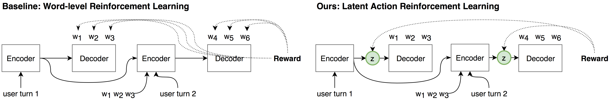

## Rethinking Action Spaces for Reinforcement Learning in End-to-end Dialog Agents with Latent Variable Models
Codebase for [Rethinking Action Spaces for Reinforcement Learning in End-to-end Dialog Agents with Latent Variable Models](https://arxiv.org/abs/1902.08858), published as a long paper in NAACL 2019 with oral presentation.

  

If you use any source codes or datasets included in this toolkit in your
work, please cite the following paper. The bibtex are listed below:
 
    @article{zhao2019rethinking,
      title={Rethinking Action Spaces for Reinforcement Learning in End-to-end Dialog Agents with Latent Variable Models},
      author={Zhao, Tiancheng and Xie, Kaige and Eskenazi, Maxine},
      journal={arXiv preprint arXiv:1902.08858},
      year={2019}
    }
    
### Requirements
    python 3
    pytorch == 0.4.0
    numpy
            
### Data
The data are in folder data. For DealOrNoDeal dataset, the files are in data/negotiate. For MultiWoz dataset,
the processed version is a zip file (norm-multi-woz.zip). Please unzip it before run any experiments for MultiWoz.

            
### Over structure:
The source code is under **latent_dialog**. The experiment script is under folders:

    - experiments_deal: scripts for studies on DealOrNoDeal
    - experiments_woz: scripts for studies on MultiWoz
    
For both datasets, the scripts follow the same structure: (1) first using supervised learning
to create pre-train models. (2) use policy gradient reinforcement learning to fine tune the pretrain
model via reinforcement learning.

Besides that, the other folders contains:
    
    - FB: the original facebook implementation from Lewis et al 2017. We the pre-trained judge model 
    to score our DealOrNoDeal conversations.
    - latent_dialog: source code 

### Step 1: Supervised Learning

    - sl_word: train a standard encoder decoder model using supervised learning (SL)
    - sl_cat: train a latent action model with categorical latetn varaibles using SL.
    - sl_gauss: train a latent action model with gaussian latent varaibles using SL.

### Step 2: Reinforcement Learning
Set the system model folder path in the script:
       
    folder = '2019-04-15-12-43-05-sl_cat'
    epoch_id = '8'
    
And then set the user model folder path in the script
    
    sim_epoch_id = '5'
    simulator_folder = '2019-04-15-12-43-38-sl_word'  # set to the log folder of the user model

Each script is used for:

    - reinforce_word: fine tune a pretrained model with word-level policy gradient (PG)
    - reinforce_cat: fine tune a pretrained categorical latent action model with latent-level PG.
    - reinforce_gauss: fine tune a pretrained gaussian latent action model with latent-level PG.